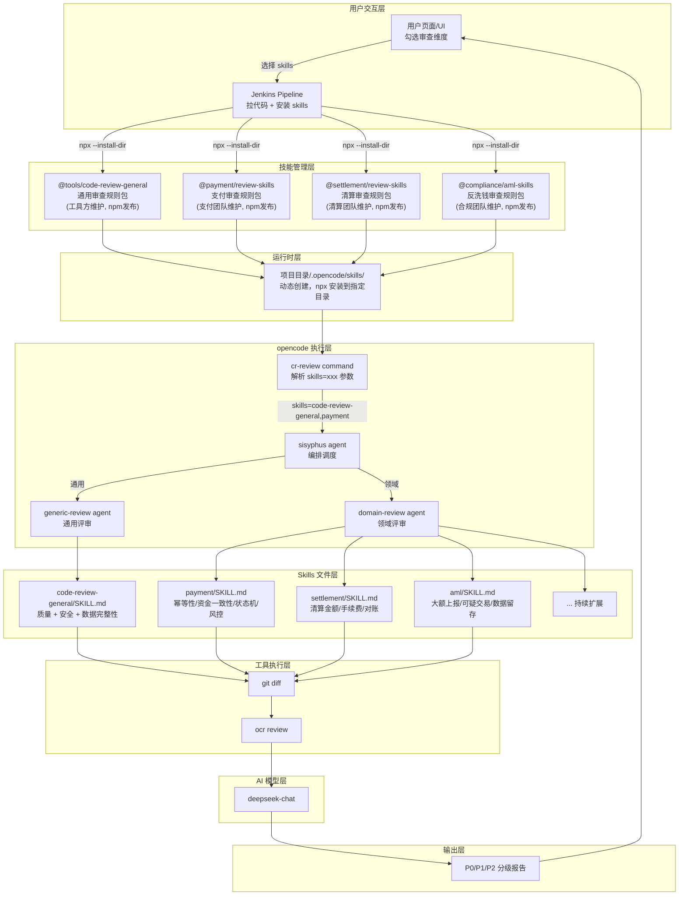

# AI 代码评审系统架构文档

> 基于 opencode + Agent + Skills 的金融级代码评审方案

---

## 目录

1. [总体架构](#1-总体架构)
2. [分层说明](#2-分层说明)
3. [评审流程](#3-评审流程)
4. [Agent 定义](#4-agent-定义)
5. [Skills 定义](#5-skills-定义)
6. [Commands 定义](#6-commands-定义)
7. [Jenkins 集成](#7-jenkins-集成)
8. [扩展指南](#8-扩展指南)
9. [完整目录结构](#9-完整目录结构)

---

## 1. 总体架构



---

## 2. 分层说明

| 层级 | 组件 | 职责 | 维护者 |
|------|------|------|--------|
| **用户交互层** | UI / Jenkins | 用户选择审查维度，触发构建 | DevOps |
| **技能管理层** | npm 包 | 各团队独立发布自己的 skill 规则包 | 工具方 / 各业务团队 |
| **运行时层** | .opencode/skills/ | Jenkins 动态创建，npx 安装到指定目录 | 自动 |
| **opencode 执行层** | command + agent | 解析参数、编排调度、加载规则 | 工具方 |
| **Skills 文件层** | SKILL.md | 具体的审查规则定义 | 各维护团队 |
| **工具执行层** | git / ocr | 获取变更、行级代码审查 | 工具方 |
| **AI 模型层** | deepseek-chat | LLM 推理引擎 | 工具方 |
| **输出层** | P0/P1/P2 报告 | 分级输出审查结果 | - |

---

## 3. 评审流程

### 3.1 完整执行流程

```
用户 UI 勾选 [code-review-general, payment, aml]
  → Jenkins 触发构建
  → 拉取代码
  → 在项目目录创建 .opencode/skills/
  → npx @tools/code-review-general    --install-dir .opencode/skills/code-review-general
  → npx @payment/review-skills         --install-dir .opencode/skills/payment
  → npx @compliance/aml-skills         --install-dir .opencode/skills/aml
  → opencode run --command cr-review "skills=code-review-general,payment,aml 审查"
  → sisyphus 解析参数
    → code-review-general → generic-review agent → 加载 code-review-general/SKILL.md
    → payment, aml        → domain-review agent  → 动态加载对应的 SKILL.md
  → 逐项执行 git diff 审查
  → P0/P1/P2 报告输出
```

### 3.2 分流规则

```
skills=code-review-general,payment,aml
         │                     │
         │                     └── 领域类（非 code-review-general）
         │                         → domain-review agent 动态加载
         │
         └── 通用类（code-review-general）
             → generic-review agent 固定加载
```

---

## 4. Agent 定义

### 4.1 generic-review（通用评审 Agent）

**路径：** `.opencode/agent/generic-review/SKILL.md`

```markdown
---
name: generic-review
description: 通用代码评审 Agent - 使用 code-review-general skill 执行通用审查
tools:
  bash: true
permissions:
  bash: allow
---

# Role
你是通用代码评审专家，加载 code-review-general skill 执行全部通用审查。

# Configuration
- skill: code-review-general（包含质量/安全/数据完整性的统一规则）
- 路径：.opencode/skills/code-review-general/SKILL.md

# Output
按 P0/P1/P2 分级输出结果。
```

### 4.2 domain-review（领域评审 Agent）

**路径：** `.opencode/agent/domain-review/SKILL.md`

```markdown
---
name: domain-review
description: 领域评审 Agent - 动态加载用户指定的领域技能
tools:
  bash: true
permissions:
  bash: allow
---

# Role
你是领域代码评审专家，负责执行用户指定的领域审查。
从 .opencode/skills/<name>/SKILL.md 动态加载规则。

# How it works
- 不预设固定技能列表，用户通过 skills=xxx 指定要执行的领域
- 从 .opencode/skills/<name>/SKILL.md 加载对应的审查规则
- 如果本地没有对应的 skill，提示用户先安装

# Output
按 P0/P1/P2 分级输出结果。
```

---

## 5. Skills 定义

### 5.1 code-review-general（通用代码审查）

**路径：** `.opencode/skills/code-review-general/SKILL.md`

| 检查项 | 说明 |
|--------|------|
| 空指针防御 | 参数未校验、链式调用、Map/List 未判空 |
| 资源泄漏 | IO/JDBC/连接池未关闭 |
| 线程安全 | 竞态条件、DCL 缺 volatile、死锁 |
| 异常处理 | catch 空块、事务未回滚 |
| 性能坏味道 | 循环拼接、拆装箱、double 算金额 |
| 编码规范 | equals 无 hashCode、魔法值 |
| 日志安全 | 敏感信息打印、日志风暴 |
| 敏感数据扫描 | 硬编码密钥、明文敏感字段 |
| 加密合规 | 弃用算法、密钥管理 |
| 认证鉴权 | 权限注解缺失、越权风险 |
| SQL注入检测 | ${} 拼接、用户输入拼接 |
| 数据完整性 | 事务边界、补偿机制、审计日志、对账 |

### 5.2 领域 Skills（示例，由各业务团队维护）

| npm 包 | 维护团队 | 检查项 |
|--------|---------|--------|
| @payment/review-skills | 支付团队 | 幂等性、资金一致性、状态机、限额风控、账务合规 |
| @settlement/review-skills | 清算团队 | 清算金额、手续费核算、渠道对账 |
| @compliance/aml-skills | 合规团队 | 大额上报、可疑交易、数据留存 |

### 5.3 Skill 文件示例

**`skills/payment/SKILL.md`：**

```markdown
---
name: payment
description: 支付交易审查 - 幂等性/资金一致性/状态机/风控/账务
---

## 幂等性
- 写接口（下单/转账/退款）是否有幂等保障
- 是否有数据库唯一索引兜底
- MQ 消费端是否处理重复消息

## 资金一致性
- 金额是否使用 BigDecimal（禁止 double/float）
- 资金操作是否在事务内
- 跨系统资金操作是否有补偿机制

## 状态机
- 状态是否通过枚举定义
- 是否存在非法跳转（已退款 → 再次退款）
- 状态更新是否带条件：WHERE status='OLD'

## 限额风控
- 单笔交易金额是否校验上下限
- 日累计/月累计是否有控制
- 高频交易是否有风控拦截

## 账务合规
- 记账是否满足借贷平衡
- 冲正/撤销是否有完整账务记录
```

---

## 6. Commands 定义

### 6.1 cr-review（评审入口）

**路径：** `.opencode/commands/cr-review.md`

```markdown
---
description: AI 代码评审 - 解析 skills=xxx 参数，通用走 generic-review，其他走 domain-review
agent: sisyphus
model: deepseek/deepseek-chat
---

从消息中解析 skills=xxx 参数，例如 skills=code-review-general,payment,aml。

按以下规则分流：
- code-review-general → 调用 generic-review agent，加载 skills/code-review-general/SKILL.md
- 其他所有领域标识 → 调用 domain-review agent，动态加载 skills/<name>/SKILL.md

各 skill 从 .opencode/skills/<name>/SKILL.md 加载规则，执行 git diff 审查，输出 P0/P1/P2 分级报告。
```

### 6.2 调用方式

```bash
# 仅通用
opencode run --command cr-review "skills=code-review-general 审查"

# 通用 + 领域
opencode run --command cr-review "skills=code-review-general,payment,aml 审查"

# 仅领域
opencode run --command cr-review "skills=payment,settlement 审查"

# UI 后端拼接
python:
  cmd = f"skills={','.join(selected)} 对当前变更执行审查"
  subprocess.run(["opencode", "run", "--command", "cr-review", cmd])
```

---

## 7. Jenkins 集成

### 7.1 Pipeline 流程

```
用户勾选 [code-review-general, payment]
  ↓
Jenkins Build:
  1. checkout scm              ← 拉取代码
  2. mkdir -p .opencode/skills/ ← 创建 skill 目录
  3. npx install 通用规则包      ← 安装选中的 skills 到指定目录
  4. npx install 支付规则包
  5. opencode run ...           ← 执行评审
  6. 取报告                     ← 获取 P0/P1/P2 结果
```

### 7.2 npx 安装说明

```bash
# 安装通用审查规则到指定目录
npx --package @tools/code-review-general \
  --install-dir .opencode/skills/code-review-general

# 安装支付审查规则到指定目录
npx --package @payment/review-skills \
  --install-dir .opencode/skills/payment

# 安装清算审查规则到指定目录
npx --package @settlement/review-skills \
  --install-dir .opencode/skills/settlement

# 安装反洗钱审查规则到指定目录
npx --package @compliance/aml-skills \
  --install-dir .opencode/skills/aml
```

### 7.3 Pipeline 代码

```groovy
pipeline {
    agent any
    
    parameters {
        choice(name: 'SKILLS', choices: [
            'code-review-general',
            'code-review-general,payment',
            'code-review-general,payment,aml,settlement',
            'custom'
        ], description: '选择审查维度')
        
        string(name: 'CUSTOM_SKILLS', defaultValue: '',
               description: '自定义组合，逗号分隔')
    }
    
    stages {
        stage('Checkout') {
            steps {
                checkout scm
            }
        }
        
        stage('Install Skills') {
            steps {
                script {
                    def skills = params.SKILLS == 'custom' ? params.CUSTOM_SKILLS : params.SKILLS
                    
                    sh """
                    mkdir -p .opencode/skills
                    
                    echo "${skills}" | tr ',' '\\n' | while read skill; do
                        case \$skill in
                            code-review-general)
                                npx --package @tools/code-review-general \
                                    --install-dir .opencode/skills/code-review-general
                                ;;
                            payment)
                                npx --package @payment/review-skills \
                                    --install-dir .opencode/skills/payment
                                ;;
                            settlement)
                                npx --package @settlement/review-skills \
                                    --install-dir .opencode/skills/settlement
                                ;;
                            aml)
                                npx --package @compliance/aml-skills \
                                    --install-dir .opencode/skills/aml
                                ;;
                            *)
                                echo "Unknown skill: \$skill"
                                exit 1
                                ;;
                        esac
                    done
                    """
                }
            }
        }
        
        stage('Code Review') {
            steps {
                script {
                    def skills = params.SKILLS == 'custom' ? params.CUSTOM_SKILLS : params.SKILLS
                    sh """
                    opencode run --command cr-review \\
                        "skills=${skills} 对当前变更执行审查"
                    """
                }
            }
        }
        
        stage('Archive Report') {
            steps {
                archiveArtifacts artifacts: 'review-report.md'
            }
        }
    }
}
```

### 7.4 关键设计

| 设计 | 说明 |
|------|------|
| **动态创建 .opencode/skills/** | 不影响项目源代码 |
| **每次构建重新安装** | 保证 skill 规则是最新的 |
| **按需安装** | 用户勾选什么就装什么 |
| **npx --install-dir** | 安装到指定目录，不污染全局 |

---

## 8. 扩展指南

### 8.1 新增一个领域 Skill

业务团队发布 npm 包，结构如下：

```
payment-review-skills/
├── package.json
└── SKILL.md    ← 按 opencode skill 标准格式编写
```

你只需要在 Jenkins pipeline 的 case 语句里加一行：

```groovy
new-domain)
    npx --package @team/new-domain-skills \
        --install-dir .opencode/skills/new-domain
    ;;
```

agent 和 command 都不需要改。

### 8.2 通用规则更新

更新 npm 包版本，下次 Jenkins 构建自动安装最新版本。

### 8.3 问题等级标准

| 等级 | 标签 | 说明 | 处理要求 |
|------|------|------|----------|
| **P0** | 阻断 | 资金安全、数据一致、严重漏洞 | 必须修复 |
| **P1** | 警告 | 线程安全、资源泄漏、业务缺陷 | 建议修复 |
| **P2** | 建议 | 编码规范、性能优化、日志规范 | 选择性修复 |

---

## 9. 完整目录结构

```
项目目录/
├── .opencode/
│   ├── agent/
│   │   ├── generic-review/SKILL.md        ← 通用评审 agent（工具方维护，固定）
│   │   └── domain-review/SKILL.md          ← 领域评审 agent（工具方维护，固定）
│   ├── skills/
│   │   ├── code-review-general/SKILL.md    ← 通用规则（工具方内置，固定）
│   │   ├── payment/SKILL.md               ← 支付规则（npx 动态安装）
│   │   ├── settlement/SKILL.md            ← 清算规则（npx 动态安装）
│   │   └── aml/SKILL.md                   ← 反洗钱规则（npx 动态安装）
│   └── commands/
│       └── cr-review.md                   ← 评审入口 command（工具方维护，固定）
├── .gitignore                              ← 忽略 .opencode/skills/ 下的动态安装文件
└── 业务代码...
```

> **skills 目录说明：** `code-review-general` 由工具方内置在项目内，其他领域 skills 由 Jenkins 通过 npx 动态安装，每次构建重新安装，不提交到项目代码库。
